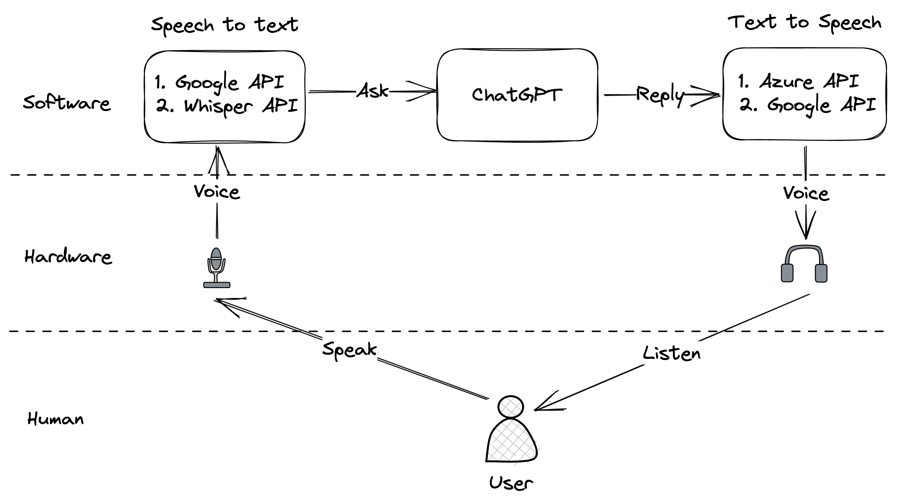

# TalkGPT

通过对话与 ChatGPT 交流的小玩具。详见：https://blog.itswincer.com/posts/chatgpt-and-tts-work-together/

## 本地运行

因为使用了 PyAudio 库来采集麦克风，macOS 设备需要先安装 portaudio 依赖。具体见：https://pypi.org/project/PyAudio/

1. 安装 [pdm](https://github.com/pdm-project/pdm)
2. pdm install
3. 新建 .env 文件，内容按照 .env-sample 填写（填写 OpenAI 的 API KEY）
4. pdm run tg/app.py

